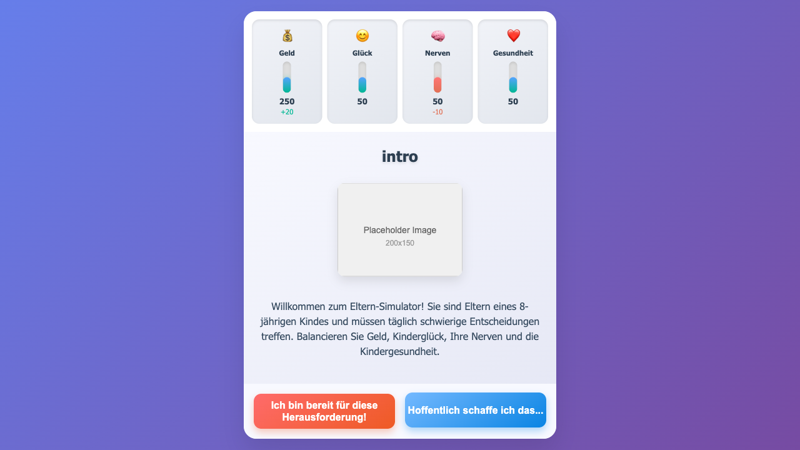

# ChoiceCore

**ChoiceCore** is a minimalist game engine for building narrative games with binary choices — think *Reigns*, but config-driven and plugin-friendly.

Write your story in YAML. Drop it in a folder. The engine takes care of the rest.

> Build games that spiral into chaos... one choice at a time.

## 🎮 Featured Game: Eltern Simulator

**Eltern Simulator** is a German parenting simulation where you navigate the chaos of raising children. Make decisions that affect your money, children's happiness, your nerves, and their health through daily parenting scenarios.

**Features:**
- 🇩🇪 Complete German language experience
- 🎯 4-power balancing system (Geld, Glück, Nerven, Gesundheit)
- 📖 Story sequences with proper narrative flow
- 🖱️ Hover previews showing power change effects
- 📱 Responsive design with vertical power bars
- 🎪 Multiple story arcs including birthday parties and pet adventures

**Play now:** `/?game=eltern_simulator`



---

## 🔧 What It Is

- A client-only static web engine with modern UI
- Loads self-contained games (cards, stories, assets) via URL param
- Powers, cards, boosters, and stories are all defined in YAML
- Advanced story sequencing and narrative tracking
- Real-time power change previews and visual feedback
- Designed to be developer-friendly and PR-ready

---

## 🧩 Plugin-Based Design

A game is just a folder:

```
games/
  my-cool-game/
    game.yaml
    cards/
      *.yaml
    boosters/
      *.yaml
    stories/
      *.yaml
    assets/
      images/
        *.png
```

You load it like this:

```
/index.html?game=my-cool-game
```

The engine will:
- Parse `game.yaml`
- Load all related content
- Start the game loop with your defined entry card

---

## ✍️ Define Your Game in YAML

### Example card

```yaml
id: mysterious_stranger
image: assets/images/stranger.png
description: "A hooded figure offers you a deal."
left:
  label: "Accept"
  effects:
    - gold: -10
    - power: +5
right:
  label: "Refuse"
  effects:
    - power: -3
follow_up: cursed_path
```

### Example booster

```yaml
id: adrenaline_rush
description: "Temporarily boosts all power caps to 150."
modifiers:
  - power_cap:
      power: "*"
      value: 150
duration: 3
```

### Example story sequence

```yaml
id: morning_routine
cards: [morning_stress, homework_drama]
trigger:
  after_cards: 1
insert_window: 3
```

---

## 🚧 Roadmap

- [x] Load games from plugin folders
- [x] YAML-defined cards, powers, boosters, stories
- [x] Advanced story tracking with completion states
- [x] Hover preview system for power changes
- [x] Responsive vertical power bar UI
- [x] Story sequence injection and narrative flow
- [ ] Local save/load system
- [ ] In-browser game editor
- [ ] Game gallery / selector UI
- [ ] GitHub PR support for new games
- [ ] Multi-language support framework
- [ ] Card animation effects

---

## 🤝 Contributing

Want to build your own game? Check out our comprehensive [Card Generation Guide](CARD_GENERATION_GUIDE.md) and [Architecture Documentation](ARCHITECTURE.md).

**Quick Start:**
1. Fork this repo
2. Create your game folder under `games/your-game-name/`
3. Follow the YAML structure in `games/eltern_simulator/`
4. Test with `/?game=your-game-name`
5. Submit a PR!

Pull requests are welcome — especially for new games. Add your name to your game metadata and we'll shout you out (or blame you) accordingly.

**Testing:** Run automated tests with `node tests/test_game.js` to verify your game logic.

---

## 🌀 Why?

Because sometimes you just want to make bad choices... fast.  
And because YAML is easier to write than code when your kingdom is falling apart.